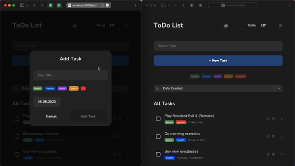
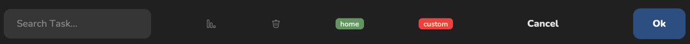
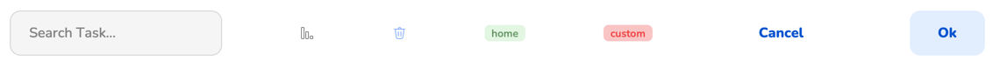

# React ToDo List

### Run project

Install all node modules:
```shell
npm i
```

Start App with Local DB:
```shell
npm run start
```

Start App **without** Local DB:
```shell
npm run serve
```

Build project:
```shell
npm run build
```

---

# Quantori Homework #8

### React

---

**Main Branch:** <a href="https://mordvintsevmv.github.io/quantori_homework_8" target="_blank">Open page</a>

**Description:** *The main branch of the app.*

---

**(HW8) Simple ToDo Branch:** <a href="https://quantori-hw8-feature-simple.netlify.app/" target="_blank">Open page</a>

**Description:** *Simple ToDo List using React.*


---

**(HW8) Advanced ToDo Branch:** <a href="https://quantori-hw8-feature-advanced.netlify.app/" target="_blank">Open page</a>

**Description:** *Advanced ToDo List using React.*

- [X] Filter by tag name
- [X] Multiple tag selection
- [X] Sort items
- [X] Edit Items

---

# Quantori Homework #9

### React-Router, Redux

---

**(HW9) ToDo Branch:** <a href="https://quantori-hw9-feature-todo.netlify.app/" target="_blank">Open page</a>

**Description:** *ToDo List using React with Redux and Router.*

From Task:

- [X] Using Redux to Store Items, Weather state and Theme mode;
- [X] Using Redux Thunk for fetching Items and Weather;
- [X] Filter by tag name;
- [X] Sort items;
- [X] Search query and Filter tags in URI;
- [X] Edit Items;
- [X] Syncing Redux State between tabs using Sync-State middlewarre.

Extra:

- [X] Dark and Light theme;
- [X] Description for Tasks;
- [X] Subtasks.

---

## <a name="content">Content</a>

1. [Task](#Task)
2. [Structure](#structure)
3. [Technical Solutions](#solutions)
   1. [(HW8) New json Server](#solutions-hosting)
   1. [(HW8) Optimizing App](#solutions-optimizing)
   1. [(HW8) Using useRef](#solutions-refs)
   1. [(HW9) Using Redux Store](#solutions-redux)
   1. [(HW9) Using React Router for searchParams](#solutions-router)
   1. [(HW9) Syncing State between Tabs](#solutions-sync)
   1. [(HW9) Custom Base Components (UI-kit)](#solutions-base-components)
5. [Contacts](#contacts)

---

## <a name="structure">Structure</a>

```
quantori_homework_8
│
└─── src - all projects scripts/img and etc
│   │   api - all scripts for fetching data (weather and items)
│   │   commonStyles - common styles for input, button
│   │   commonScripts - common scripts for project (Items sorting and etc)
│   │   components - folder for Funcitional React Components
│   │   types - folder for custon types (Item, WeatherResponse and etc)
│   │   index.ts - entry point for React App
│   └─  ...
│   
│
└─── public - files, that should be copyied without changings 
│   │   favicon - favicon folder
│   │   og_image.png - OG image
│   └─  ...
```

---

## <a name="Task">Task</a>

- [X] Rewrite App using React

---

## <a name="solutions">Technical Solutions</a>

### <a name="solutions-hosting">Hosting json on remote server</a>

Since the JSONbin server speed was very slow, it was decided to find an alternative.
A suitable solution was the <a href="https://www.cyclic.sh">Cyclic</a>, which allows you to deploy and host one project for free.

Based on an already existing local json-server, it was developed <a href="https://github.com/mordvintsevmv/todo-api">db server project</a> and deployed to Cyclic.

All data can be accessed by link: https://brainy-hem-lion.cyclic.app

Since the advanced version of the application uses a slightly different Task Item structure, it was decided to make two arrays:

- **items_simple** - items for simple App (old structure)

```javascript
interface Item {
    id: string,
    isChecked: boolean,
    title: string,
    tag: string,
    date: string,
}
```

- **items** - items for advanced App (new structure)

```javascript
interface Item {
    id: string,
    isChecked: boolean,
    title: string,
    tag: string[],
    date_complete: string,
    date_created: string
}
```

---

### <a name="solutions-optimizing">Optimizing App with useCallback and useMemo hooks</a>

Without optimizing the App, there can be a lot of unnecessary renderings of components that do not change their state or props.

**For example:**

Each time the Search Input value changes, react will rerender every task Component again.


To optimize the App, it was decided to:

- Wrap all task items in useMemo:
```javascript
let finished_items: Item[] = useMemo(
    () => items.filter((item) => item.isChecked),
    [items])
```

- Wrap all functions (passed as props) with useCallback:
```javascript
const checkItem = useCallback(async (id: string): Promise<void> => {...},[items])
```

- Wrap all **necessary** Components with memo:
```javascript
const TaskItem: FC<TaskItemProps> = memo(({item, deleteItem, checkItem}) => {...})
```

After the changes are made, we will check how many times the tasks are rerendered:

- No rerenders, if no new tasks (in case of filtering items):


- Rerender only new tasks (on clearing input, for example):


It was decided not to wrap each function, variable or component in these hooks, since this is not always rational.
For example, openModal function used only in App Component and didn't passed as props, so it does not affect the rendering of other components.

```javascript
const openModal = (): void => {
    setIsAddTaskModal(true)
}

```

---

### <a name="solutions-refs">Getting active tags with useRef hook (while creating new task)</a>

The task was told to use uncontrolled inputs for forms.
Therefore, in AddTask Component for each tag it was created ref with useRef():

```javascript
const tag_home_ref = useRef<HTMLInputElement>(null)
const tag_health_ref = useRef<HTMLInputElement>(null)
```

Each ref was passed as props for custom Component CustomCheckInput.

Usage:

```javascript
const CustomCheckInput: FC<CustomCheckInputProps> = ({...ref_check...}) => {

    return (
        ...
            <input className={"custom-check-input__input"} type={type} name={name} value={value}
                   defaultChecked={isDefault} ref={ref_check}/>
        ...
    )
}
```

This approach allows us to get the state of input (checked or not) and get its value.

```javascript
    const addTaskHandler = () => {
...
    if (tag_home_ref.current?.checked) {
        tag = tag_home_ref.current.value
    }
...
}
```

Also it was decided to use a controlled input for the Title of the task,
since we need to dynamically change the state of the add task button (enabled or disabled).

```javascript
// State
const [titleState, setTitleState] = useState < string > ("")

// Input
< input
placeholder = {"Task Title"}
className = {"text-input add-task__input"}
type = {"text"}
value = {titleState}
onInput = {handleTitleChange} />

// Button
<button className={"button add-task__ok-button"} onClick={addTaskHandler}
        disabled={titleState.length < 1}>Add Task
</button>
```

---

### <a name="solutions-redux">Using Redux Store</a>

Redux Store was used for storing all data, that can be used globally in the application. Therefore, 3 Redux Slice were created:

*src/redux:*
- **Item Slice:** items, fetch status (idle, loading, error or success), error message and status of TodayShown Modal;
- **Weather Slice:** weather state, fetch status and error message;
- **Theme Slice:** theme mode (dark or light)

Also, custom Typed Hooks have been developed for useDispatch and useSelector:

```javascript
export const useTypedDispatch: () => AppDispatch = useDispatch
export const useTypedSelector: TypedUseSelectorHook<RootState> = useSelector
```
*src/hooks*

Redux-thunk was used for fetching data from the server (tasks and weather). If the data is fetched successfully, the data itself is returned. In case of an error, the error message is returned, which the user will then see:

*Example of Async Thunk:*
```javascript
export const fetchItems = createAsyncThunk(
    'items/fetchItems',
    async (arg, thunkAPI) => {
        try {
            const response = await serverFetchItems()
            return thunkAPI.fulfillWithValue(response)
        } catch (error) {
            if (axios.isAxiosError(error))
                return thunkAPI.rejectWithValue(error.message)
            else
                return thunkAPI.rejectWithValue(`Unexpected error`)
        }
    }
)
```

*Data handling:*
```javascript
export const itemSlice = createSlice({
    ...
    extraReducers: (builder) => {

        builder.addCase(fetchItems.fulfilled, (state, action) => {
            state.status = statusType.SUCCESS;
            state.items = action.payload
            state.error = null;
        })

        builder.addCase(fetchItems.rejected, (state, action) => {
            state.status = statusType.ERROR;
            state.error = action.payload
        })
    }
})
```

This approach allows always know about the status of the data and show the necessary information to the user:

- Loading page on data Idle or Loading status;
- Error message on Error status;
- Content on Success status.

---

### <a name="solutions-router">Using React Router for searchParams</a>

In order to store search query and applied tag filters in URI, it was decided to use a useSearchParams hook from React Router framework:
```javascript
const [searchParams, setSearchParams] = useSearchParams()

const searchQuery = searchParams.get("q")
const filtersQuery = searchParams.get("filters")
```
*src/components/Home/Home.tsx*

Search and Tag filters are updated for each change in the filtering parameters:
- On every change of search input;
- On adding or removing Tag filter.

In order to save the parameters when the page is reloaded, it was decided to use useEffect and set the initial value of the searchInput and Filters state:
```javascript
    useEffect(() => {
    if (searchQuery)
        setSearchInput(searchQuery)

    if (filtersQuery)
        setFilterTags(filtersQuery.split(','))
}, [])
```
*src/components/Home/Home.tsx*

This approach made it possible to use filtering by Search Query and by several Tags at once and save the parameters when the page is reloaded.

---

### <a name="solutions-sync">Syncing State between Tabs</a>

To synchronize the state, it was decided to use <a href="https://github.com/aohua/redux-state-sync">Redux-State-Sync 3</a> middleware.

It was necessary to add middleware to the store:
```javascript
export const store = configureStore({
    reducer,
    middleware: (getDefaultMiddleware) =>
        getDefaultMiddleware().concat(createStateSyncMiddleware()),
})
```
*src/redux/store.ts*

And wrap reducers with:
```javascript
const reducer = withReduxStateSync(combineReducers({
    items: itemReducer,
    weather: weatherReducer,
    theme: themeReducer
}))
```
*src/redux/store.ts*

In order for the new tab to immediately receive the state of the parent tab, also need to call the function:
```javascript
initStateWithPrevTab(store);
```
*src/redux/store.ts*

**Result:**



---

### <a name="solutions-base-components">Custom Base Components (UI-kit)</a>

In order for the base elements (inputs, buttons and etc) of the App to have one style,
it was decided to start creating a set of basic components with the predefined styles.
The <a href="https://mui.com">MUI library</a> approach was taken as a basis, but in conform with the layout of the task.

The developed components automatically customize to a light and dark theme,
have fixed dimensions and the possibility of customizing (for example, *s*, *m* or *l* sizes, *transparent* button or *colored* tag).

Dark theme:



Light Theme:




This approach allows not to think about assigning the necessary className to the element
(so that the styles of all similar components are the same),
and also not to manually add styles for dark and light themes.

---

## <a name="contacts">Contacts</a>

**TG**: [@mordvintsevmv](https://t.me/mordvintsevmv)

**e-mail**: mordvintsevmv@gmail.com


[🔝Content🔝](#content)


